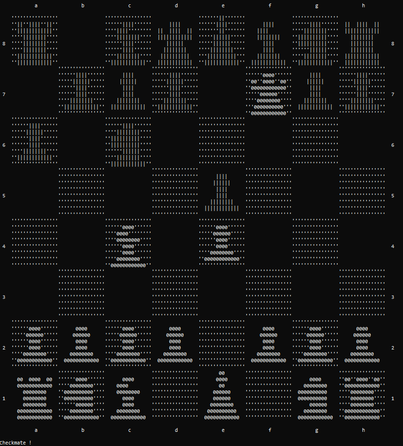
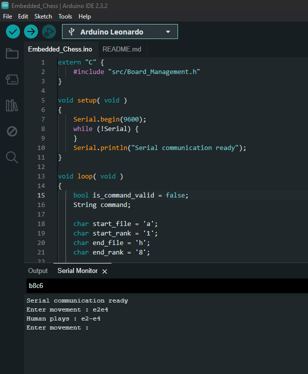

# Embedded_Chess
Provides an implementation of the chess game suitable for embedded system (optimized for a 16 bits microcontroller).

The characteristic of this implementation are :
* efficient CPU usage
* low memory consumption :
  * 14026 bytes of ROM
  * 1611 bytes of RAM
* no dynamic memory allocation

This application implements an AI based on the alpha–beta pruning algorithm.

## Rules

The rules implemented by the application are the ones published by FIDE except :
* A _pawn_ is always promoted as a _queen_.
* The number of movements is limited due to memory limitation (tippically 128 movements).
* _Draw_ is not implemented except _stalemate_.

## Design model

### User interface

This diagram gives the interface that a user of this application can use.

## Debug

To ease debug, a controller and a console viewier are added. The controller can
acces the interface *Board_Management*.

It can be use to play chess on a computer...

The possible commands are :
* A movement given as the initial postion followed by a final position, knowing that a position is a file (from __a__ to __h__) and a rank (from __1__ to __8__).  
Exemples :
  * __e2e4__
  * __a1a8__
* __play__ : to ask the IA to play (by default the depth of the Alpha–beta pruning algorithm is 1 for White and 4 for Black)
* __undo__ : to undo the last move (either manual or by the IA).
* __quit__ : to exit from the application.

## Demo

To test the application on an embedded system the _Arduino_ sketch __Embedded_Chess.ino__ is provided.

It interfaces the application using __Serial__ communication.

