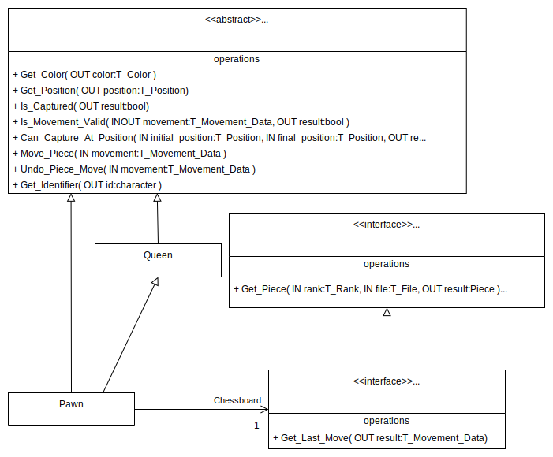

# Embedded_Chess
Provide an implementation of the chess game suitable for embedded system.
The characteristic of the implementation are :
* low memory consumption
* no dynamic memory allocation

To ease debug, a controller and a viewer for console are added.

## Design model

### User interface

### Board

### Piece

### Pawn

Pawn class specialize Queen class.  
It allows Pawn class to re-use the implementation of the abstract methods from
Piece by Queen class.

### King

### Queen, Knight, Rook and Bishop

